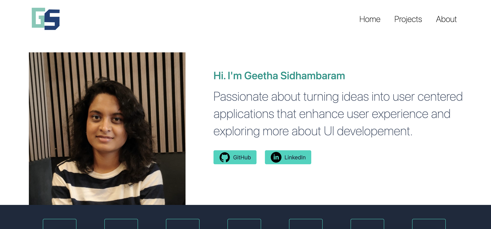
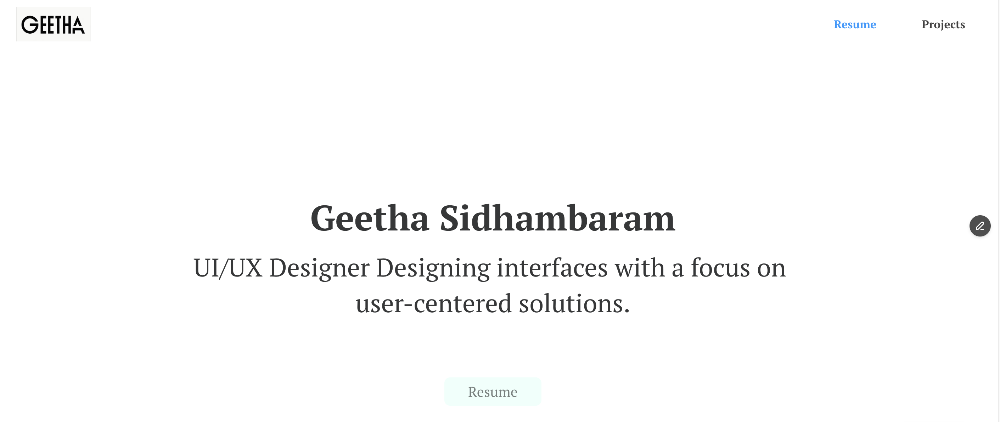
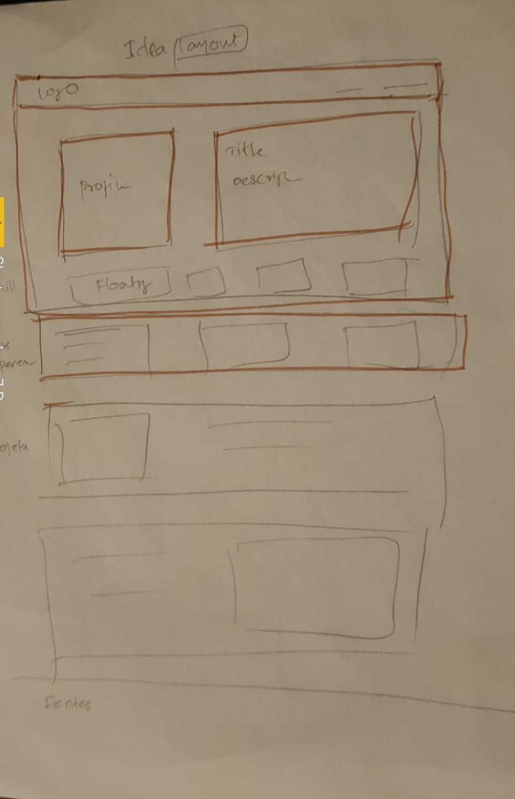

# Build a Portfolio - UI Developement using HMTL , Tailwind CSS

1. Header
2. Hero section
3. Projects section
4. Work experience
5. Footer

## 🚀 Vercel : https://geetha-site.vercel.app/

## 💻 Technologies Used

- HTML
- CSS
- Tailwindcss

## 🚀 How did I approached UI:

- Research:
 Inspired by different type of portfolio pages adn comes uo with what are informaiton can add as per my progress and skill. 
 reference :https://sidhgeetha.framer.website/

 
 

- Wireframe: Elements 
  Had an Idea to have  header, main-hero section, projects section, work experiecen and footer section.

- Colour and font
  using color palette and font "font-montserrat" to improvise the readability and visually appeal.

- UI Design
  Build a responsive portfolio using Tailwindcss classes for layout structure and styling the components to focus on easy navigation and guide the user effectively.

## 🚀 Tools Used
• VSCode for coding and Live Preview plugin
• Netlify
• Github

